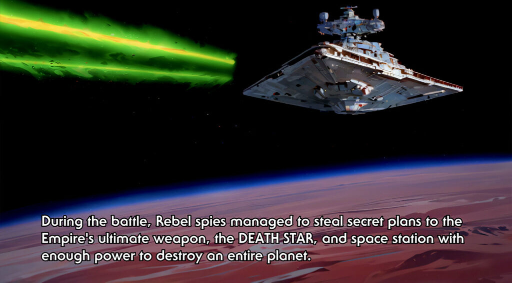
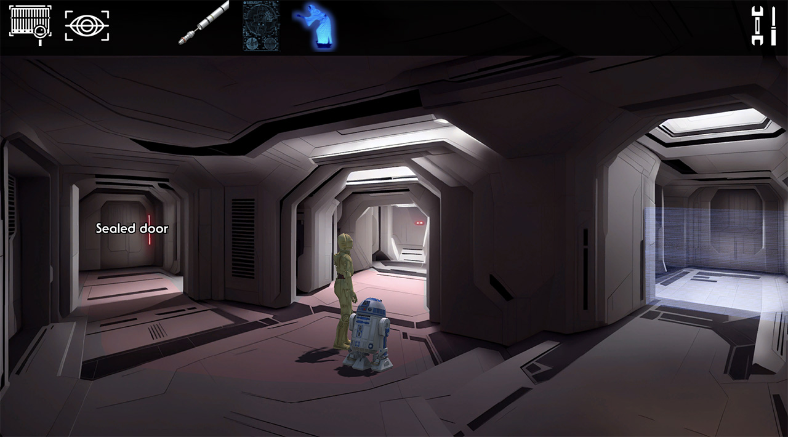

## R2 Quest

I have a strong fondness for point-and-click adventure games. Although there have been many recent indie titles in this genre, I can’t help but feel that progress has stagnated since the days of “Grim Fandango.”

I’ve noticed a peculiar pattern in my gaming preferences: I’m predominantly drawn to pixel art adventure games. I often find myself diving headfirst into them, whereas high-quality cartoon-like or 3D-rendered adventure games fail to pique my interest. I won’t hesitate to start a pixel art game, yet I’d think twice before investing time in a 3D Unreal-powered adventure.

Upon some introspection, I realized that my aversion to certain adventure games is rooted in their evolution. It seems we’ve veered away from the DNA of classic LucasArts adventures, heading towards the tail end of interactive movies with simplified puzzles. While I appreciate some Telltale games for their stories, they don’t quite scratch that adventure game itch for me.

Take “The Wolf Among Us,” for instance. I thoroughly enjoyed it, but it didn’t leave me feeling like a detective.

So, what exactly is it about adventure games that enthralls me? It’s the fusion of puzzle-solving and storytelling.

In my view, a puzzle game centers around puzzles as the primary mechanic. You solve them for the sheer satisfaction of cracking the code, like completing a Rubik’s cube.

On the other hand, interactive adventures, such as many Telltale titles, shine due to their narrative. The more cinematic it feels, the more I’m invested. However, maintaining the right pacing is essential in such games, and getting stuck on a puzzle can break that flow. Hence, most of these games opt for easy puzzles or none at all. It’s a deliberate choice to ensure a cinematic experience.

For me, a point-and-click adventure game reaches its peak when it strikes a balance between being a puzzle game and an interactive adventure. It’s a realm where puzzle-solving and storytelling coexist harmoniously. The best of these games seamlessly bridges the gap between puzzles and story progression. You solve a puzzle not just for the thrill of solving it, but as a means to advance the narrative. The reward for your efforts is the unfolding of the story.

This approach might affect the pacing, favoring a more relaxed storytelling style. Adventure games are like cozy mysteries.

Recently, while playing “Virtual Verse,” I couldn’t help but feel disappointed. The game boasted stunning visuals, but its narrative choices constantly pulled me out of the immersive experience. It made me realize that many modern retro-looking adventures incorporate puzzles that don’t contribute to the story’s depth.

This led me to think: How could this be done better? I’ve formulated the following methodology to answer that question.

1. **Scene Composition as an Event:**
    - Begin by framing the scene as a pivotal event within the game’s narrative. For example, consider a scenario where R2-D2 needs to escape from a rebel ship with the Death Star plans.
2. **Incorporate Dramatic Tension:**
    - To infuse the scene with energy and engagement, establish an antagonist, which could be represented metaphorically as a puzzle door. Clearly define the player’s objective within the scene, aligning it with the story’s direction.
    - In our example, Princess Leia instructs R2-D2 to reach the escape pod to locate Obi-Wan Kenobi. R2-D2’s goal is to access the escape pod. The antagonist in this scenario is C-3PO, who opposes R2-D2’s entry due to droids’ non-admittance.
3. **Identify the Puzzle Solution as the Scene Fulcrum:**
    - The scene should pivot around the resolution of the puzzle. The player’s progress within the scene should be intrinsically linked to puzzle-solving. Emphasize that the puzzle’s solution propels the storyline forward dramatically.
    - For instance, the scene culminates when R2-D2 and C-3PO successfully escape in the pod. This puzzle concludes with R2-D2 persuading C-3PO to activate the eject button.
4. **Balanced Scene and Puzzle Development:**
    - Develop the scene and puzzle elements in parallel, allowing them to evolve together. This synchronicity ensures that both aspects complement each other harmoniously.
    - The scene should encompass dramatic moments, exposition, character growth, and conflicts, while the puzzle design should feature multiple steps and incorporate mini-puzzles. Strive for a balanced distribution; an excess of scene elements may resemble a cut-scene, whereas an overabundance of puzzles could hinder pacing.
    - In the case of R2-D2’s escape, he encounters a locked pod deck, which becomes a pivotal puzzle. In parallel, while attempting to unlock the deck, R2-D2’s interactions with the ship’s computer introduce character growth and exposition. Additionally, within the escape pod deck, confrontations with C-3PO contribute to character dynamics and storytelling.

This methodology hopefully ensures that adventure game scenes are not only engaging and immersive but also seamlessly integrate puzzle-solving with narrative progression, enhancing the overall player experience.

After thinking about this for a while, I decided to implement this approach to see if it was effective, and the result is the game demo R2’s Quest.

Check the demo game at: [https://perezbalen.itch.io/r2quest](https://perezbalen.itch.io/r2quest)